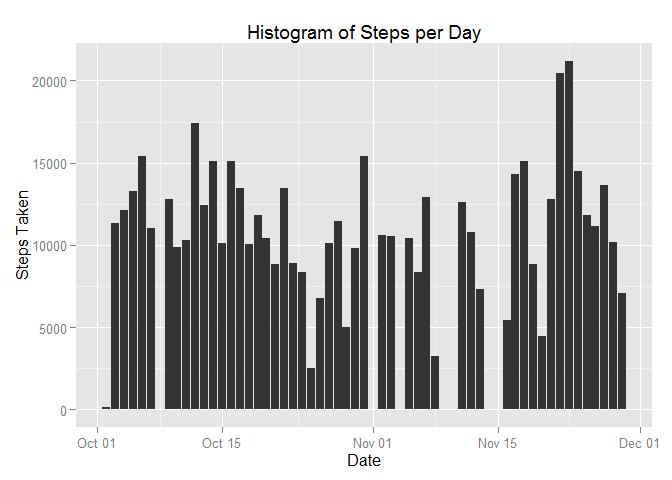
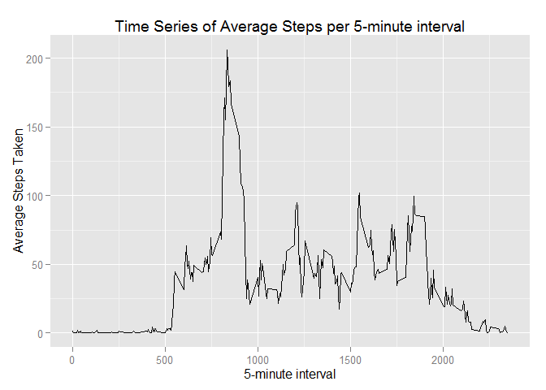
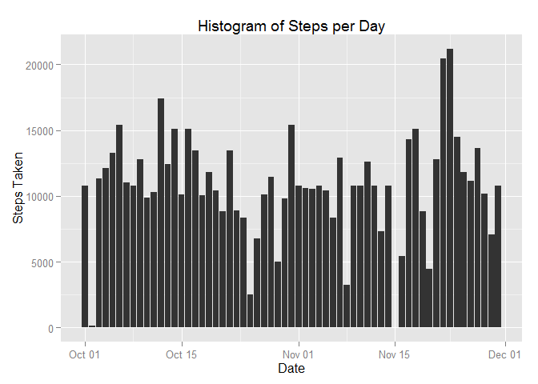
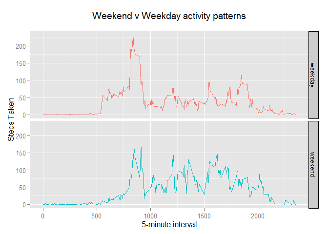

# Reproducible Research: Peer Assessment 1

###Loading and preprocessing the data

Set working directory and load dplyr and ggplot2 packages, silencing package message. Unzip and read file. Convert data frame to tbl then convert date column to date format.  


```r
setwd("C:/Users/Dangermonger/Documents/GitHub/RepData_PeerAssessment1")

library(dplyr, warn.conflicts=FALSE) 
library(ggplot2)

unzip("./activity.zip") 

actdata <- read.csv("activity.csv")
convertbl <- tbl_df(actdata) %>%
    mutate(date = as.Date(date, format = "%Y-%m-%d")) 
```

###What is mean total number of steps taken per day?

####1. Calculate the total number of steps taken per day

Group by date column and then sum steps. Print as data frame to show total per day.


```r
sumtable <- convertbl %>% 
    group_by(date)%>% 
    summarise(steps = sum(steps))

print.data.frame(sumtable)
```

```
##          date steps
## 1  2012-10-01    NA
## 2  2012-10-02   126
## 3  2012-10-03 11352
## 4  2012-10-04 12116
## 5  2012-10-05 13294
## 6  2012-10-06 15420
## 7  2012-10-07 11015
## 8  2012-10-08    NA
## 9  2012-10-09 12811
## 10 2012-10-10  9900
## 11 2012-10-11 10304
## 12 2012-10-12 17382
## 13 2012-10-13 12426
## 14 2012-10-14 15098
## 15 2012-10-15 10139
## 16 2012-10-16 15084
## 17 2012-10-17 13452
## 18 2012-10-18 10056
## 19 2012-10-19 11829
## 20 2012-10-20 10395
## 21 2012-10-21  8821
## 22 2012-10-22 13460
## 23 2012-10-23  8918
## 24 2012-10-24  8355
## 25 2012-10-25  2492
## 26 2012-10-26  6778
## 27 2012-10-27 10119
## 28 2012-10-28 11458
## 29 2012-10-29  5018
## 30 2012-10-30  9819
## 31 2012-10-31 15414
## 32 2012-11-01    NA
## 33 2012-11-02 10600
## 34 2012-11-03 10571
## 35 2012-11-04    NA
## 36 2012-11-05 10439
## 37 2012-11-06  8334
## 38 2012-11-07 12883
## 39 2012-11-08  3219
## 40 2012-11-09    NA
## 41 2012-11-10    NA
## 42 2012-11-11 12608
## 43 2012-11-12 10765
## 44 2012-11-13  7336
## 45 2012-11-14    NA
## 46 2012-11-15    41
## 47 2012-11-16  5441
## 48 2012-11-17 14339
## 49 2012-11-18 15110
## 50 2012-11-19  8841
## 51 2012-11-20  4472
## 52 2012-11-21 12787
## 53 2012-11-22 20427
## 54 2012-11-23 21194
## 55 2012-11-24 14478
## 56 2012-11-25 11834
## 57 2012-11-26 11162
## 58 2012-11-27 13646
## 59 2012-11-28 10183
## 60 2012-11-29  7047
## 61 2012-11-30    NA
```
####2. Make a histogram of the total number of steps taken each day

Assign axes and label plot. Include stat = 'identity' to explicitly represent values for y axis.


```r
ggplot(data=sumtable, 
    aes(x = date, y = steps)) + 
    labs(title="Histogram of Steps per Day") +
    labs(x="Date", y="Steps Taken") + 
    geom_histogram(stat = "identity")
```

```
## Warning: Removed 8 rows containing missing values (position_stack).
```

 

####3. Calculate and report the mean and median of the total number of steps taken per day

Print mean and median


```r
mean(sumtable$steps, na.rm = TRUE)
```

```
## [1] 10766.19
```

```r
median(sumtable$steps, na.rm = TRUE)
```

```
## [1] 10765
```
###What is the average daily activity pattern?

####1. Make a time series plot (i.e. type = "l") of the 5-minute interval (x-axis) and the average number of steps taken, averaged across all days (y-axis)

Calculate the mean of the steps taken by each interval group, ignoring NA values.


```r
timetable <- convertbl %>% 
    group_by(interval)%>% 
    summarise(steps = mean(steps, na.rm = TRUE))
```

Assign axes and label line graph plot. 


```r
ggplot(data=timetable, 
    aes(x = interval, y = steps)) + 
    labs(title="Time Series of Average Steps per 5-minute interval") +
    labs(x ="5-minute interval", y ="Average Steps Taken") + 
    geom_line()
```

 

####2. Which 5-minute interval, on average across all the days in the dataset, contains the maximum number of steps?

Subset the row at the maximum steps value.


```r
timetable[which(timetable$steps == max(timetable$steps)),] 
```

```
## Source: local data frame [1 x 2]
## 
##   interval    steps
## 1      835 206.1698
```
###Imputing missing values

####1. Calculate and report the total number of missing values in the dataset (i.e. the total number of rows with NAs)

Sum NAs in steps column.


```r
sum(is.na(actdata$steps))
```

```
## [1] 2304
```

####2. Devise a strategy for filling in all of the missing values in the dataset. 

Group data by interval, rewrite steps column where nas are replaced by the mean of the interval group.

####3. Create a new dataset that is equal to the original dataset but with the missing data filled in.


```r
nonas <- convertbl %>% 
    group_by(interval) %>%
    mutate(steps = ifelse(is.na(steps), +
    mean(steps, na.rm = TRUE), steps))
```

####4. Make a histogram of the total number of steps taken each day and calculate and report the mean and median total number of steps taken per day. 

Group by date and sum steps.


```r
sumnonas <- nonas %>% 
    group_by(date)%>% 
    summarise(steps = sum(steps))
```

Assign axes and label plot. Include stat = 'identity' to explicitly represent values for y axis.


```r
ggplot(data=sumnonas, 
       aes(x = date, y = steps)) + 
       labs(title="Histogram of Steps per Day") +
       labs(x="Date", y="Steps Taken") + 
       geom_histogram(stat = "identity")
```

 

List mean and median, before and after imputation of NA values.


```r
mean(sumnonas$steps)
```

```
## [1] 10766.19
```

```r
median(sumnonas$steps)
```

```
## [1] 10766.19
```

```r
mean(sumtable$steps, na.rm = TRUE)
```

```
## [1] 10766.19
```

```r
median(sumtable$steps, na.rm = TRUE)
```

```
## [1] 10765
```

####Do these values differ from the estimates from the first part of the assignment? 

The mean and the median are now identical.

####What is the impact of imputing missing data on the estimates of the total daily number of steps?

The mean is exactly the same because mean imputation does not affect the sample mean. Mean imputation brings the median closer to the mean.

###Are there differences in activity patterns between weekdays and weekends?
    
####1. Create a new factor variable in the dataset with two levels - "weekday" and "weekend" indicating whether a given date is a weekday or weekend day.

Assign Saturday and Sunday to weekend handle. Convert date column to weekdays. Where weekdays are equal to Saturday and Sunday, convert to 'weekend', otherwise convert to 'weekday'. Convert date column to factor variable. Group by date and interval then calculate the mean of steps by groups.


```r
weekend <- c("Saturday", "Sunday")

weekdaysdata <- nonas %>%
    mutate(date = weekdays(date)) %>%
    mutate(date = ifelse(date %in% weekend, "weekend", "weekday")) %>%
    mutate(date = as.factor(date))%>%
    group_by(date, interval)%>% 
    summarise(steps = mean(steps))
```

####2. Make a panel plot containing a time series plot of the 5-minute interval (x-axis) and the average number of steps taken, averaged across all weekday days or weekend days (y-axis).

Assign axes, colour by date, plot line graph facets horizontally. Add outline to facet label, remove legend. Label and title graph.


```r
ggplot(data=weekdaysdata, aes(x=interval, y=steps, colour=date )) + 
    facet_grid(date ~ .)+ 
    geom_line()+ 
    theme(strip.background = element_rect(colour="black")) + 
    guides(color=FALSE) +
    xlab("5-minute interval") + ylab("Steps Taken") + 
    ggtitle("Weekend v Weekday activity patterns\n") 
```

 
